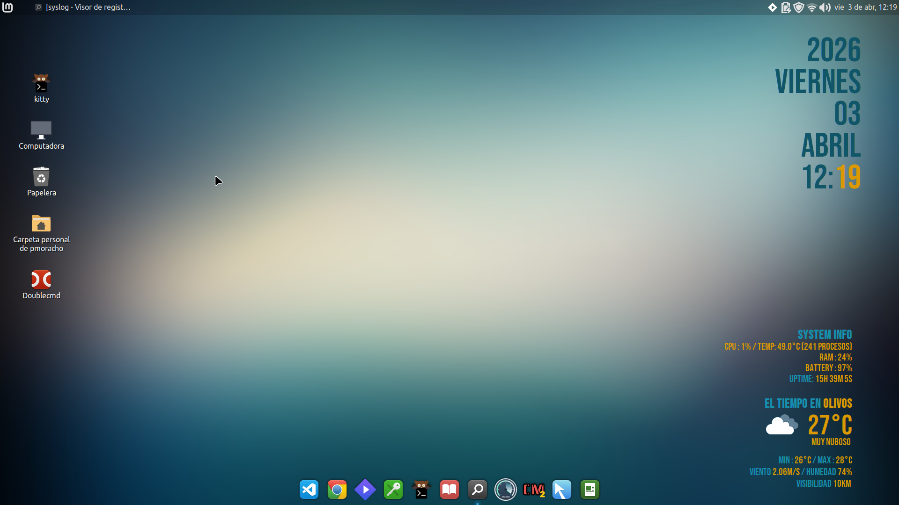

# Conky Widget - Pato


Widget de escritorio minimalista para Linux con **reloj**, **info del sistema** y **clima en tiempo real** via OpenWeatherMap.



---

## Características

- 🕐 **Reloj** con año, día, fecha y hora en tipografía grande (Bebas Neue)
- 💻 **System Info**: CPU, temperatura, RAM, batería, uptime
- 🌤️ **Clima** (OpenWeatherMap): temperatura actual, descripción, mín/máx, viento, humedad, visibilidad
- Ícono del clima descargado automáticamente y cacheado
- Fondo completamente transparente (ARGB)
- Todo en español, configurado para **Olivos, Buenos Aires, AR**

---

## Fuentes requeridas

| Fuente | Uso |
|--------|-----|
| [Bebas Neue](https://fonts.google.com/specimen/Bebas+Neue) | Reloj, datos, títulos |
| [Comfortaa](https://fonts.google.com/specimen/Comfortaa) | Texto base del widget |

El instalador las descarga automáticamente desde Google Fonts. También podés correr el script por separado:

```bash
chmod +x install-fonts.sh
./install-fonts.sh
```

Las fuentes se instalan en `~/.local/share/fonts/conky-pato/` (sin necesitar `sudo`).

---

## Dependencias

| Paquete | Uso |
|---------|-----|
| `conky` | Motor del widget (≥ 1.10) |
| `jq`    | Parseo del JSON del clima |
| `curl`  | Descarga del JSON y del ícono |

```bash
sudo apt install conky jq curl
```

---

## Instalación

```bash
git clone https://github.com/TU_USUARIO/conky-pato.git ~/.conky
cd ~/.conky
chmod +x install.sh scripts/weather.sh
./install.sh
```

El instalador:
1. Verifica dependencias
2. Copia los archivos a `~/.conky/`
3. Crea el symlink `~/.conkyrc → ~/.conky/conkyrc`
4. Hace la primera descarga del clima

---

## Configuración

### API Key del clima

Editá `scripts/weather.sh` y reemplazá:

```bash
API_KEY="TU_API_KEY_AQUI"
CITY_ID="3430310"   # ID de OpenWeatherMap para Olivos, AR
```

Obtené tu API key gratis en [openweathermap.org/api](https://openweathermap.org/api).

Para buscar el `CITY_ID` de tu ciudad: [openweathermap.org/find](https://openweathermap.org/find).

### Sensor de temperatura

La temperatura de CPU se lee de:

```
/sys/class/hwmon/hwmon5/temp1_input
```

Verificá cuál `hwmonX` corresponde a tu CPU:

```bash
grep -r '' /sys/class/hwmon/hwmon*/name 2>/dev/null
```

Ajustá la línea correspondiente en `conkyrc`.

### Posición del widget

En `conkyrc`, modificá según tu resolución y monitor:

```lua
alignment = 'middle_middle',
gap_x     = -730,
gap_y     = 300,
```

---

## Uso

```bash
# Iniciar
conky -c ~/.conkyrc &

# Detener
pkill conky

# Actualizar clima manualmente (con verbose)
~/.conky/scripts/weather.sh -v
```

### Autostart (opcional)

Creá `~/.config/autostart/conky.desktop`:

```ini
[Desktop Entry]
Type=Application
Name=Conky Widget
Exec=conky -c /home/TU_USUARIO/.conkyrc
Hidden=false
X-GNOME-Autostart-enabled=true
```

---

## Estructura del proyecto

```
~/.conky/
├── conkyrc              ← Configuración principal de Conky
├── install.sh           ← Instalador principal (llama a install-fonts.sh)
├── install-fonts.sh     ← Descarga e instala Bebas Neue y Comfortaa
├── scripts/
│   └── weather.sh       ← Fetcher del clima (OpenWeatherMap)
├── images/
│   └── screenshot.png   ← Captura de pantalla
└── README.md
```

Cache generado en runtime:

```
~/.cache/weather_conky/
├── weather.json         ← Datos del clima (JSON)
├── weather_icon.png     ← Ícono activo (usado por Conky)
└── icons/
    └── *.png            ← Íconos cacheados por código
```

---

## Colores

| Variable | Color | Uso |
|----------|-------|-----|
| `default_color` | `#115668` (teal oscuro) | Texto base |
| `color1` | `#da9902` (dorado) | Valores, minutos, datos |
| `color2` | `#188fad` (celeste) | Labels y títulos |

---

## Créditos

- Basado en la estructura de [mrmierzejewski/conkyrc](https://github.com/mrmierzejewski/conkyrc)
- Script de clima inspirado en el trabajo de [Closebox73](https://github.com/closebox73)
- Autor: **Pato** — pmoracho@gmail.com

---

## Licencia

Distribuido bajo los términos de [GPLv3](https://www.gnu.org/licenses/gpl-3.0.html).
